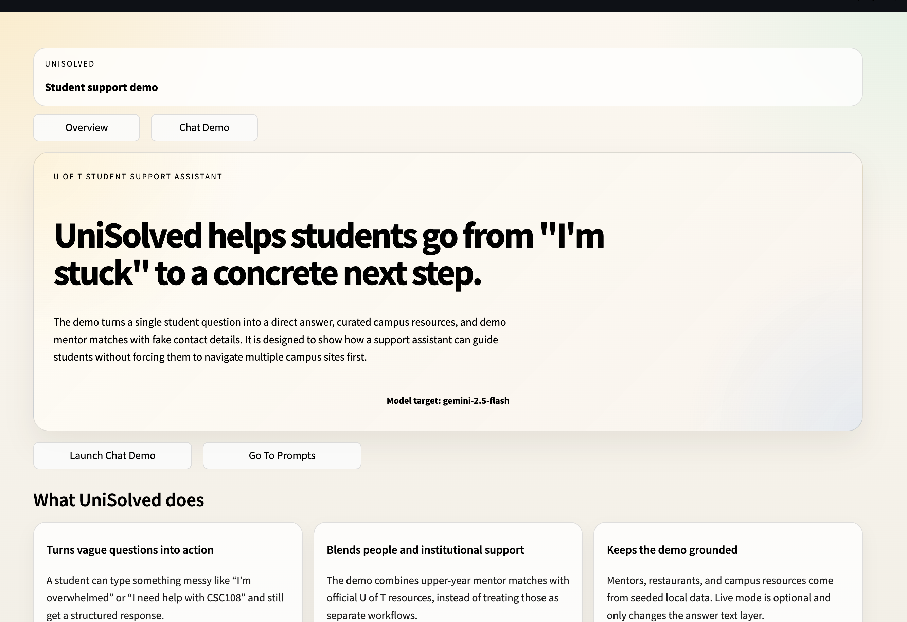
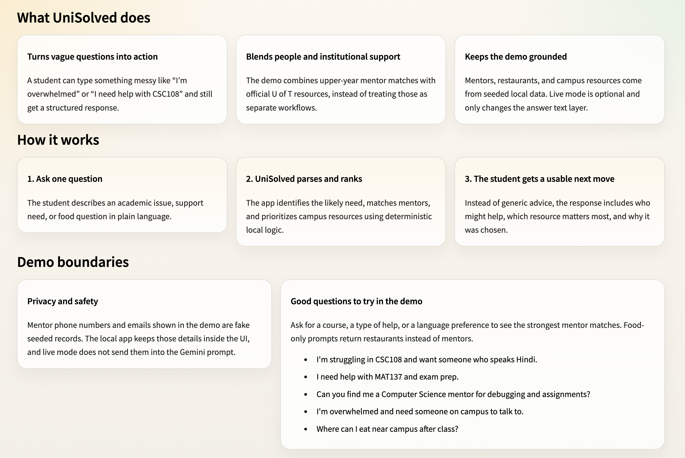
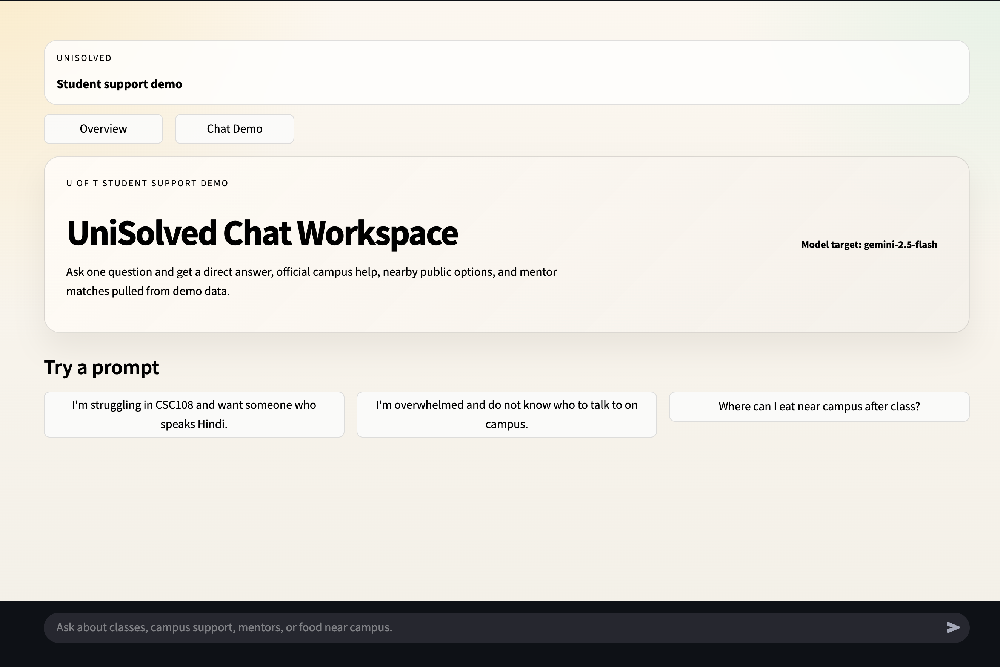
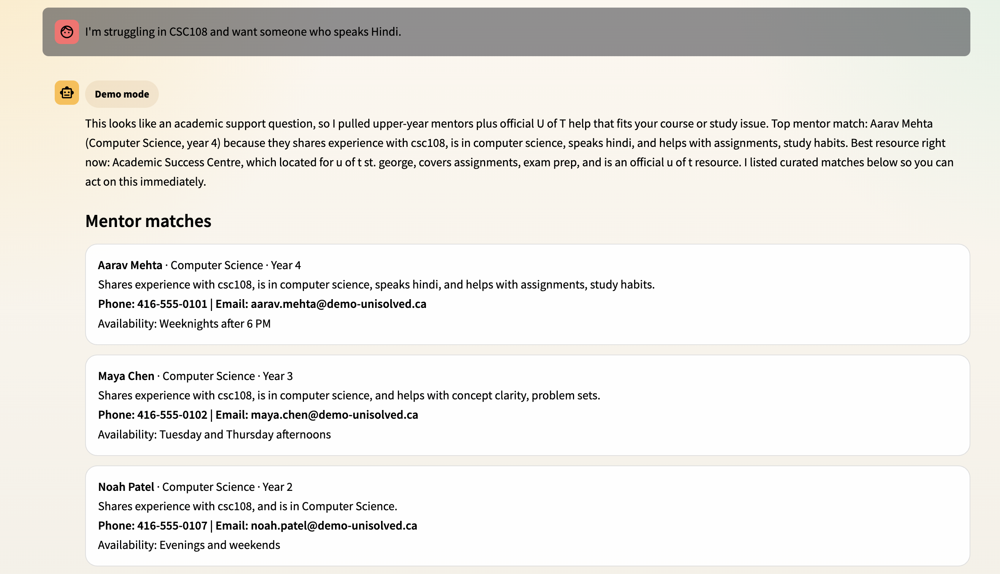
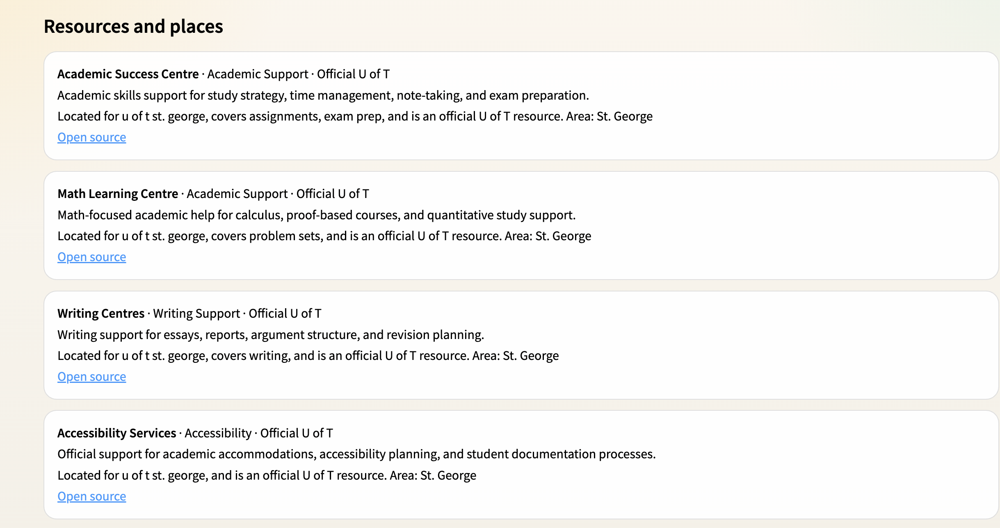
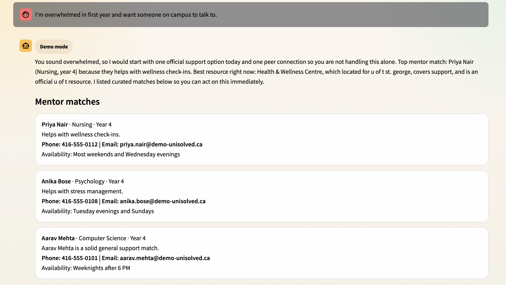
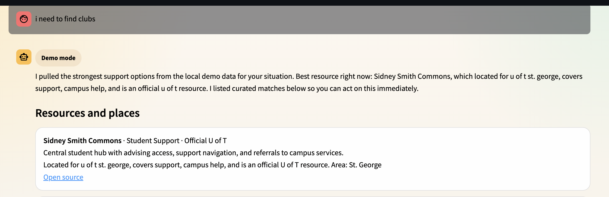

# UniSolved

UniSolved is a student-support assistant built around a single idea: a student should be able to ask one plain-language question and immediately get a useful next step. Instead of forcing students to search across multiple U of T resources, the app combines a direct response, ranked campus resources, and mentor recommendations in one workflow.

The current implementation supports academic support, wellness-style support questions, administrative guidance, and nearby food discovery. It runs locally in Streamlit, uses a privacy-safe seeded SQLite dataset by default, and can optionally layer Gemini with Google Search grounding on top of the answer text when a `GEMINI_API_KEY` is provided.

## Screenshots




### looking for a mentor



### Overwhlemed


### Clubs


## What The Project Covers

- Landing page that explains the product before entering the chat demo
- Chat-first Streamlit interface for U of T support questions
- Privacy-safe seeded SQLite dataset created automatically on first run
- Ranked mentor recommendations based on course overlap, language fit, program fit, and support topic relevance
- Ranked resource suggestions that prioritize official campus support when the question calls for it
- Food discovery mode for nearby public options around campus
- Optional Gemini integration for answer drafting with Google Search grounding
- Local fallback path so the product still works without API keys

## What Makes It Unique

- It does not behave like a generic chatbot. UniSolved narrows the problem to a student-support workflow and produces a structured response instead of open-ended conversation only.
- It blends institutional support and peer support in the same response. A student can see both the best official resource and the best mentor match without switching tools.
- It is designed for fast triage. The goal is not just to answer a question, but to reduce uncertainty and point the student toward an action they can take immediately.
- It stays privacy-aware. The local app can display mentor contact details in the UI while keeping those contact details out of live Gemini prompts.

## How The Ranked System Works

UniSolved uses deterministic matching logic on top of parsed student intent. A student message is first converted into a structured need profile that captures likely issue type, course codes, campus, language preference, and whether the student is looking for people, official resources, or food.

Mentor ranking then scores each profile using:

- direct course overlap
- same-program alignment
- preferred language match
- help-topic overlap with the student issue
- slight weighting toward upper-year mentors

Resource ranking uses a similar scoring model, but weights different signals:

- same-campus relevance
- overlap between resource tags and the student issue
- official-vs-public source priority
- category boosts for academic, wellness, administrative, career, or food intent

The result is a response that is consistent, explainable, and testable. The same prompt should produce the same ordering when the input context is unchanged.

## What I Learned

- Narrow product scope matters. The app improved once the experience was framed as student support triage instead of a general assistant.
- Deterministic ranking is useful before adding heavier AI behavior. It made the output easier to reason about, easier to test, and more defensible.
- Privacy decisions need to be explicit. It was not enough to remove secrets from the repo; outbound prompt content also had to be reviewed so mentor contact details stayed local.
- Demo quality depends on presentation as much as logic. The landing page, structured answer layout, and screenshot-backed README all made the project easier to understand as a finished product.

## Modes

- `Local mode`: fully local, backed by seeded SQLite data. This works without API keys.
- `Live Gemini mode`: uses Gemini with Google Search grounding for the answer section when `GEMINI_API_KEY` is configured. Mentor matching and ranked campus resources still come from the local application logic.

## Project Layout

```text
UniSolved_WEBSITE.py        Streamlit entrypoint
UniSolved_BACKEND.py        Legacy note for the removed voice prototype
ss/                         README screenshots
unisolved/
  chat.py                   Orchestrates parsing, matching, and answer generation
  config.py                 Environment-driven settings
  database.py               SQLite setup and seed loading
  gemini_client.py          Optional Gemini integration with Google Search grounding
  matching.py               Mentor/resource ranking logic
  models.py                 Typed records used across the app
  parsing.py                Deterministic student-need extraction
  seed_data.py              Seeded mentors/resources/restaurants
  streamlit_app.py          UI rendering
tests/
  test_chat.py
  test_matching.py
  test_streamlit_app.py
```

## Setup

1. Create and activate a Python 3.12 virtual environment.
2. Install dependencies:

```bash
pip install -r requirements.txt
```

3. Optional: enable live Gemini mode by copying `.env.example` to `.env` or exporting the variables in your shell.

Environment variables:

- `GEMINI_API_KEY`: optional, enables live Gemini mode
- `GEMINI_MODEL`: optional, defaults to `gemini-2.5-flash`
- `UNISOLVED_DB_PATH`: optional, defaults to `data/unisolved_demo.sqlite3`

## Run The App

```bash
.venv/bin/python -m streamlit run UniSolved_WEBSITE.py
```

The UI opens on the landing page first and then routes into the chat demo.

## Run Tests

```bash
.venv/bin/python -m unittest discover -s tests -v
```

## Data Notes

- The application ships with privacy-safe seeded sample data for mentors, campus resources, and restaurants.
- Mentor contacts in the UI are synthetic placeholder records, not real personal data.
- Campus resources and restaurant links point to public sources.
- The project does not scrape websites directly.

## Security And Merge Hygiene

- The active repo tree does not contain a tracked `.env`, local SQLite database, API key, or database password.
- `.gitignore` excludes local secrets, SQLite files, Streamlit config, editor state, and Python cache files.
- In live Gemini mode, the outbound prompt includes the student question, parsed need, and non-contact summaries of curated matches. Mentor phone numbers and emails are kept local to the UI.
- This repository currently has no local commit history yet, so there is no existing git history to audit in this checkout.
- If real credentials were ever used in another copy of the project, they should be rotated before the code is published.

## References

- Google Search grounding docs: https://ai.google.dev/gemini-api/docs/google-search
- Model capability overview: https://ai.google.dev/gemini-api/docs/models/gemini-v2
